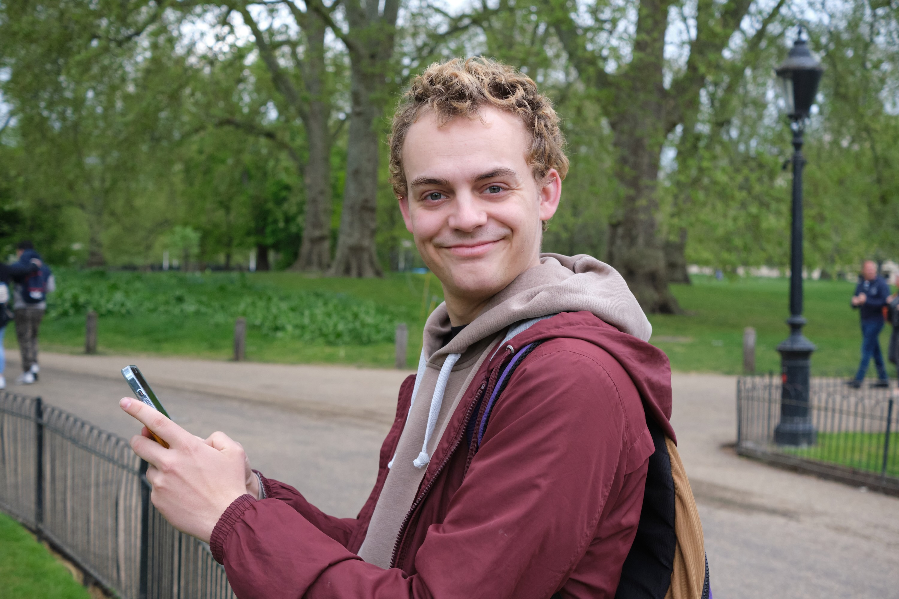

As a designer I am trying to make the world more aesthetically interesting. Not only visually but also how we interact with different designs. Improving upon existing concepts has always been I thing I like to do. As a musician I started changing compositions by other composers to make them more beautiful. This eventually led into me composing my own music. For designing I am planning on taking the same path.

Within the area of design I am mostly interested in the looks and inner workings of designs. Prototyping is one of my strong points. Coming up with new designs and also to making the first prototypes work is where my skillset comes in. With my proactive and hands on way of working I like to quickly conduct different iterations so that in the end we can have the best result. I love learning how to work with new materials and how to make the prototyping process more efficient in general.

I am an enthusiastic and creative worker that likes to explore ideas with other people. Working together in a team is one of my strong points and is something I like to do.

Some Designers/Engineering artists that really inspire me are Simone Giertz from shitty robots, Martin Molin from Wintergatan and Matt Benedetto from unnecessary inventions. What all of these designers have in common is that they all combine creativity with technology. Each of them puts their creativity to create something completely unique. 

In the future, when more and more things will be automated, we as humans get to spend a lot more time on exploring our creativity.  As a designer I believe I can play an important role in designing for this future. With my background as a multi instrument musician and a fair share of knowledge of digital music creation, combined with my technical skill as a designer and engineer, I think many interesting project opportunities lie ahead in the field of music creation.

How can we maybe even involve AI into the music making process? What other options are there to explore? How can technology be used to create  more accessible instruments?