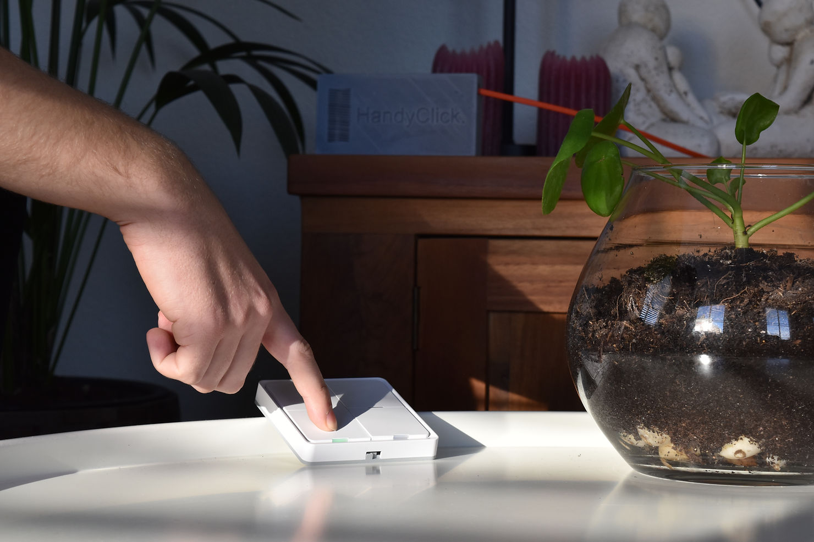
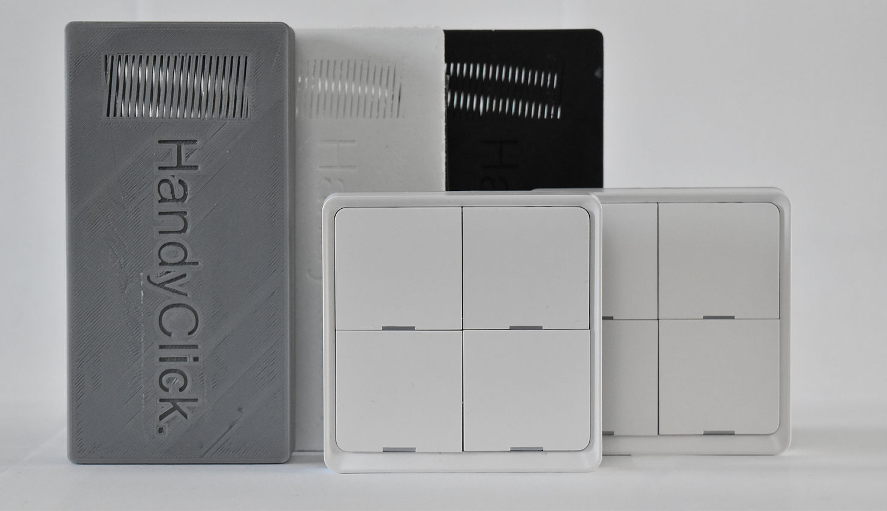

The problem which inspired us to develop this product is, that smart technology consists of very complicated and intricate user interfaces and it can be very hard to learn how to use initially. 
Many elderly people are lonely and if they get no visitors, will not be able to socialize with anyone outside of their place of residence. Without the ability to use smart technology, wireless communication is limited for these people. 
A big part of this problem is also that many elderly see no need for technology. A lot of them say things like “I am too old for this”. As developers of the HandyClick, we disagree with statements like these and think everyone can improve their lifestyle with the help of technology. 
HandyClick brings multi-button-press actions on a smart device down to one single press on a separate piece of hardware. 

