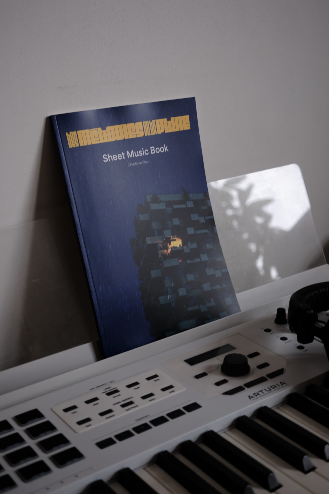
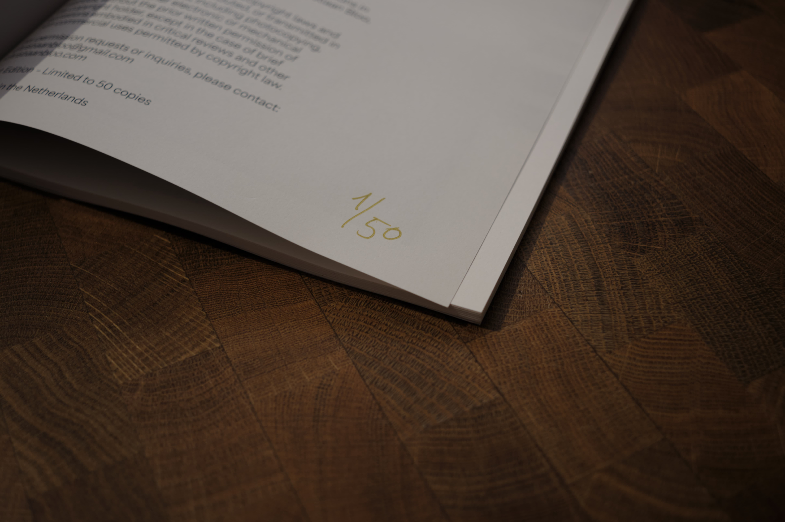
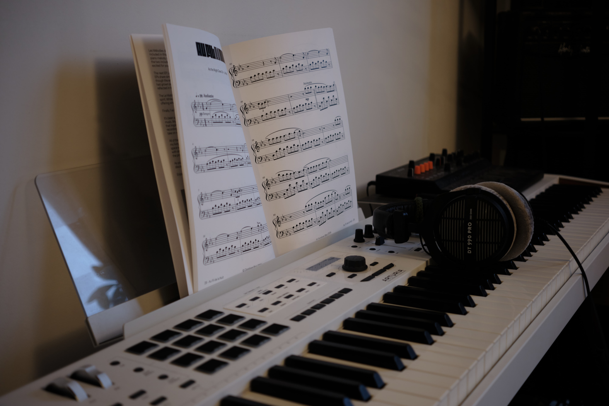
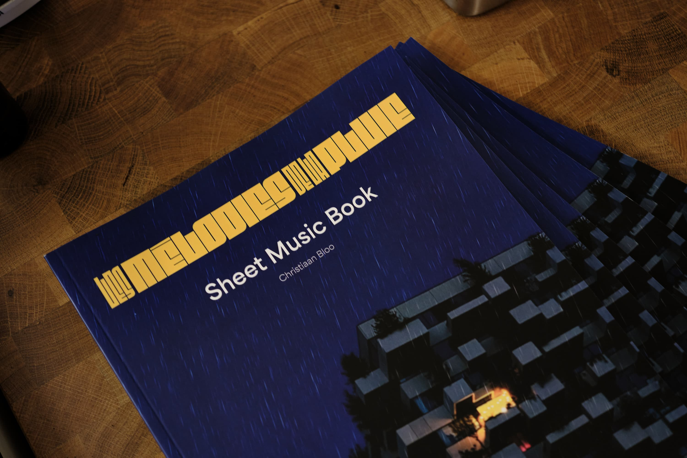

This limited-edition sheet music book features selected compositions from two of my EPs—Les Mélodies de la Pluie and La Nuit—as well as singles like Le Matin and a special bonus track, Sur l’eau. Each piece was composed on the piano in my living room!

Whether you're familiar with my music or discovering it for the first time, this collection offers a chance to dive deeper into the melodies and emotions behind the recordings. The book includes solo piano arrangements, perfect for musicians looking to connect with neo-classical.

Limited to just 50 copies, each edition is hand-numbered, making it a unique keepsake for anyone who loves exploring new music at the piano.

For any orders, please contact me at christiaanbloo@gmail.com.  
Price €12.50

