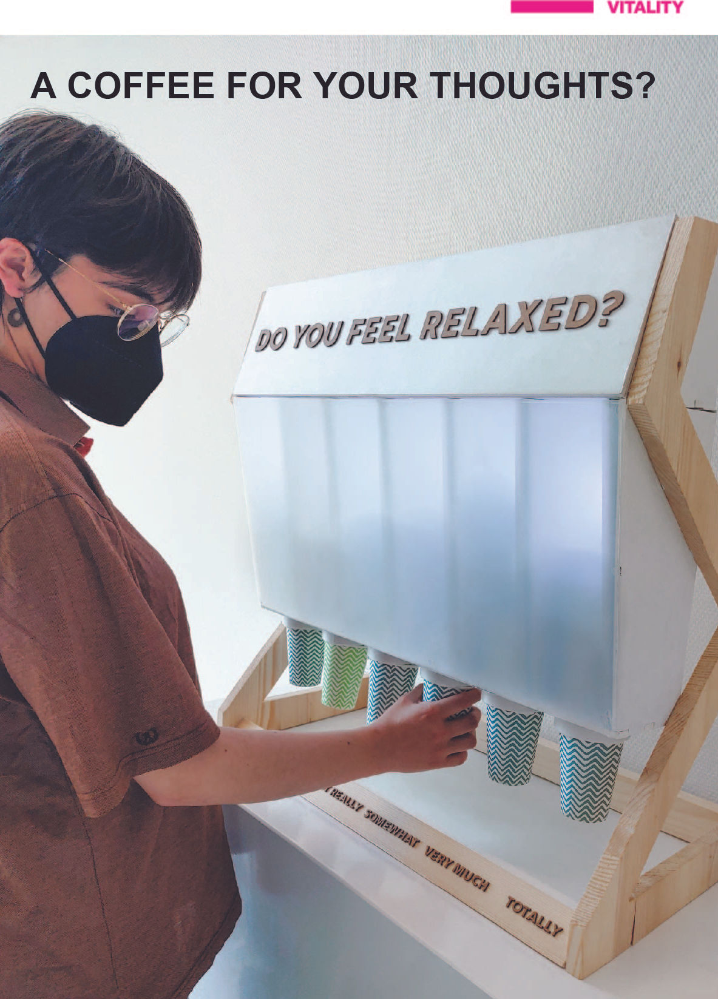
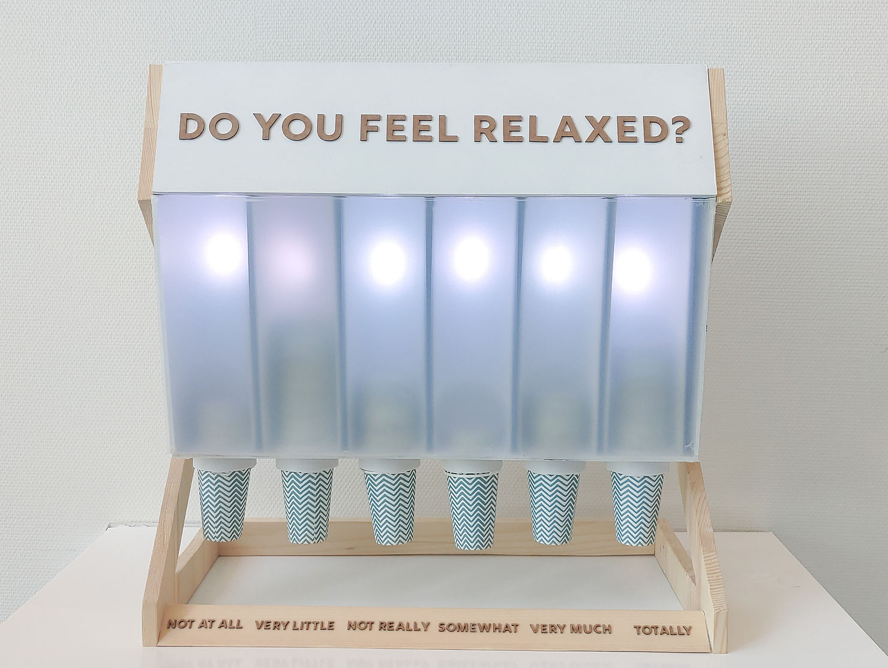
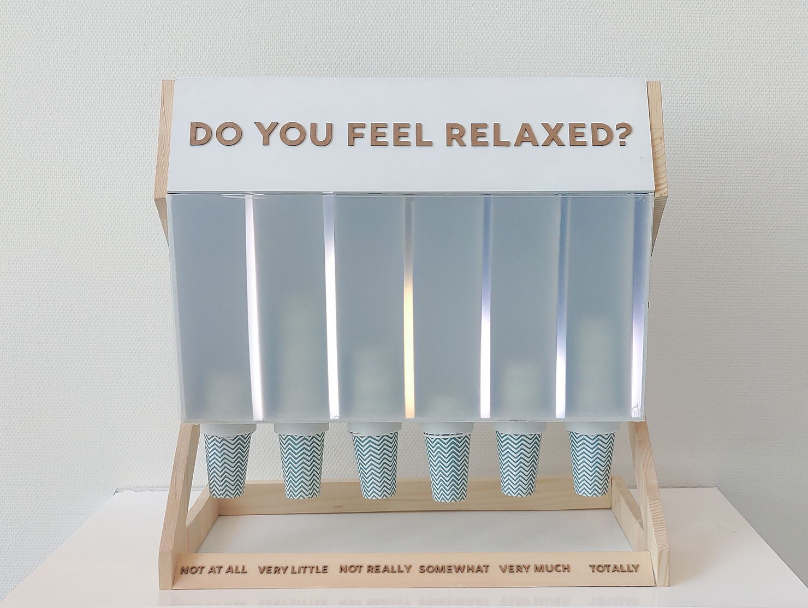
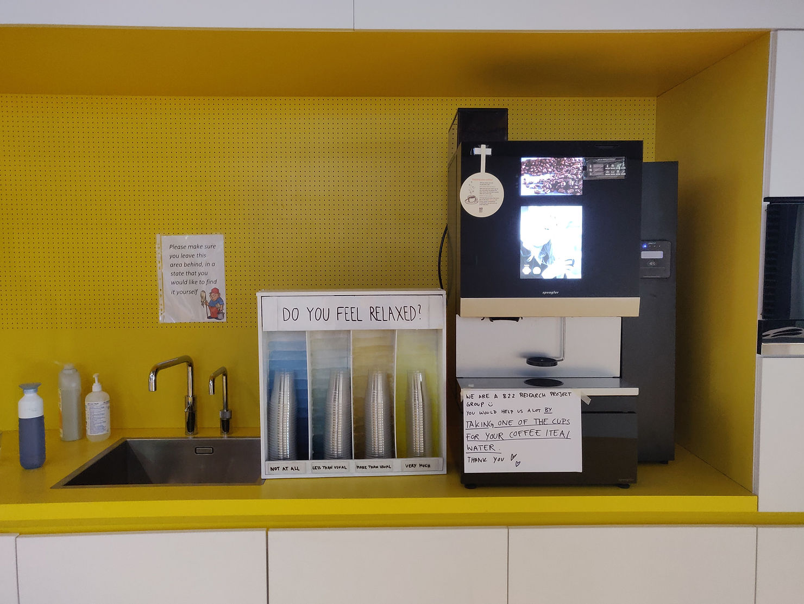

There still is a taboo about discussing mental wellbeing in the office. The goal of this research through design project was to shine light on this stigma and to find a way to create an atmosphere where employees can talk about their wellbeing. 

Stacktistics was designed to show an analogue graph of the collective wellbeing in the office during the day in order to stimulate reflection and start conversations.

A triangulation of quantitative and qualitative research methods is used to find out whether visualizing the collective wellbeing in the office sparks conversations about personal wellbeing. 

It was not possible to prove a difference in the office where the test was conducted, but that might be because there actually was no taboo present. There is still a lot to find out about this topic, and a future experiment can serve as an intervention in an office to make wellbeing a topic that can be discussed

