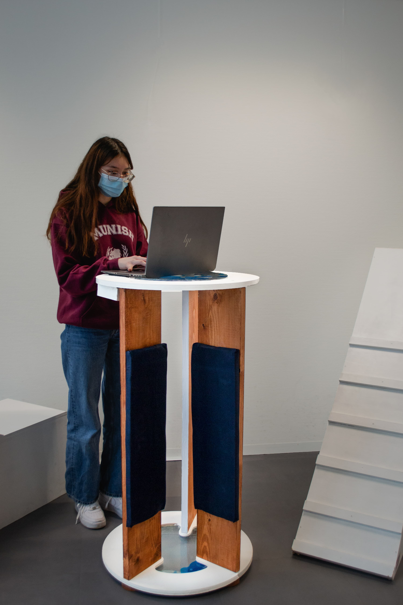
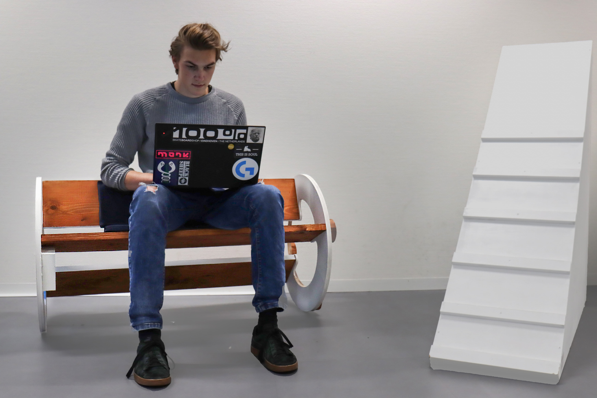
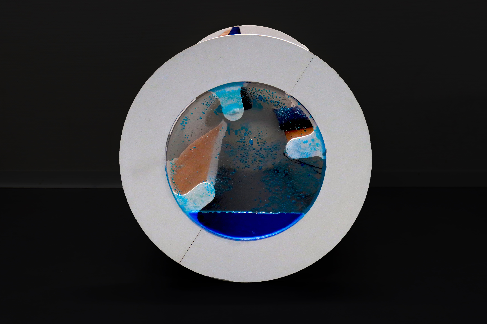
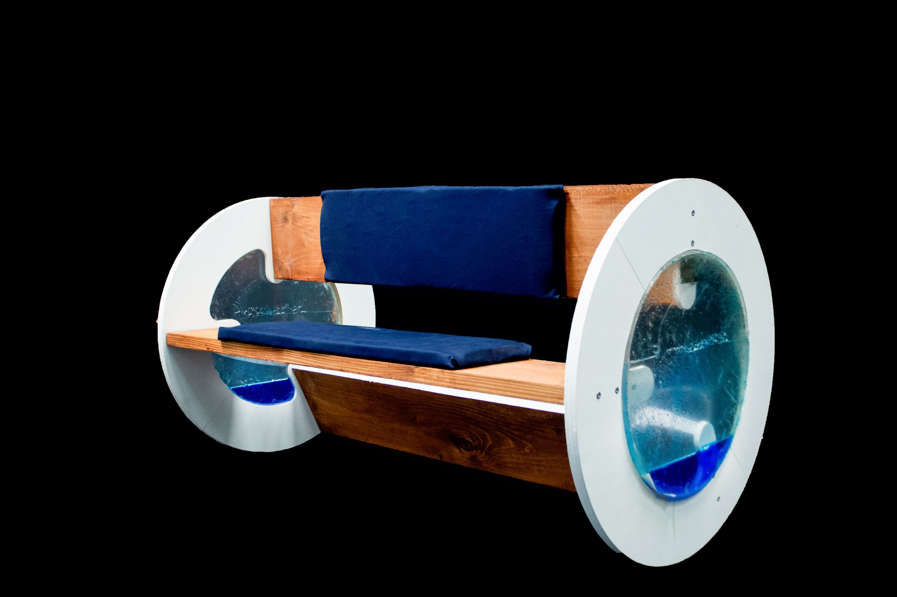
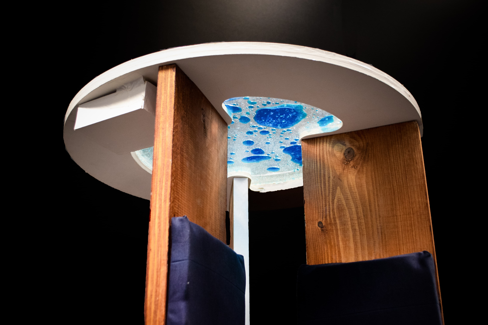

Endless sedentary office meetings affect employees’ health. Standa is a modular piece of furniture combining a chair and a standing desk. Its cylindrical shape and unbalanced gravity center require extra effort from users when sitting, nudging them to stand up. Aesthetical emulsion trackers visualize the user’s activity, while sensors additionally collect anonymous data about people’s behavior during meetings. This data can be used to adjust the design of active meeting spaces, for employees to improve their work routines, or for companies to keep track of healthy behavior at work. So, are you going to stand up against the standard?



