

## Nacht van Strijp-S

### Mijn rol  
Als projectleider van dit initiatief bij **Jong040** was ik verantwoordelijk voor de communicatie met alle betrokken partijen, het uitwerken van het concept en het ontwerpen van de visuele elementen van het project. Ik werkte nauw samen met **DIY** om de installatie te realiseren, waarbij we samen brainstormden over het ontwerp en de locatie. Mijn focus lag op het vertalen van ideeën naar een concreet, aansprekend concept en op het zorgen dat het project soepel verliep.

### Concept  
Het project bood een unieke kans: midden in een bruisend cultureel evenement in Eindhoven bezoekers uitnodigen om te praten over kunst en cultuur in de stad. Ons doel was inzicht krijgen in hoe mensen kunst en cultuur beleven en wat zij belangrijk vinden voor de toekomst.  

In eerste instantie dachten we aan post-its, maar ik kwam met het idee om gedachten en wensen **vast te leggen op tegels**. Dit bood een duurzaam en tastbaar medium met een culturele knipoog naar Delfts blauw. Zo werd het concept zowel praktisch als betekenisvol.  

Samen met DIY ontwikkelde ik het idee verder, waarbij we kozen voor een specifieke plek in het “makershuis”: de badkamer. Deze intieme, herkenbare ruimte nodigt uit tot openheid en gesprek, en versterkte de beleving van het project.

### Uitwerking  
Op **20 en 21 september 2025** bouwden we samen met DIY de badkamer-installatie in Hal-C van het Klokgebouw. Bezoekers konden letterlijk “bij ons in bad stappen” om het gesprek aan te gaan.  

Ik bereidde drie kernvragen voor die bezoekers konden beantwoorden om hun eigen “wijsheid” te formuleren:  
1. Wat ontbreekt er nog in de Eindhovense cultuur scene?  
2. Waar blinkt Eindhoven echt in uit op het gebied van kunst en cultuur?  
3. Waar hoop je dat Eindhoven bekend om staat qua kunst en cultuur over 30 jaar?  

Tijdens de gesprekken begeleidde ik bezoekers en vroeg ik hen hun antwoorden op tegels vast te leggen. Zo ontstond een groeiende collectie van persoonlijke bijdragen. De samenwerking met DIY zorgde ervoor dat de installatie technisch en logistiek goed werd opgebouwd, terwijl ik me richtte op concept, communicatie en visuele uitwerking.  

  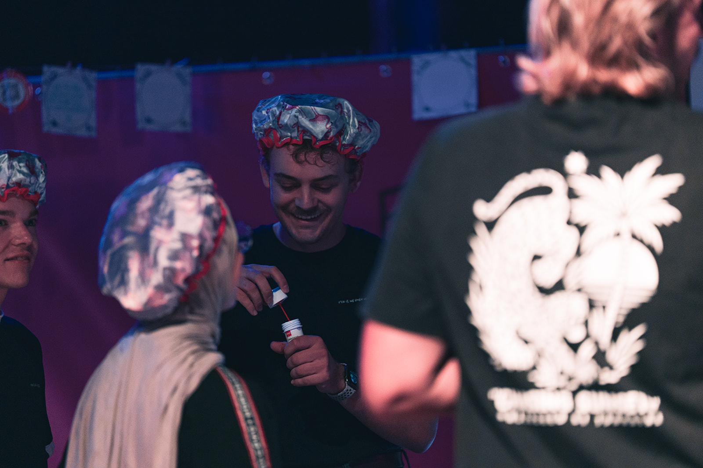
  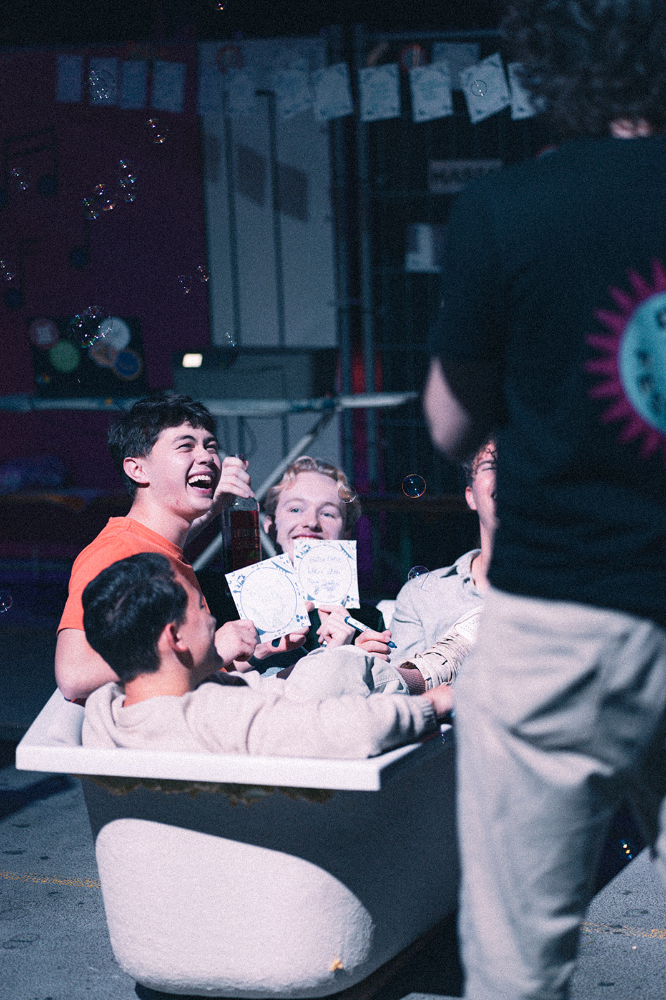
  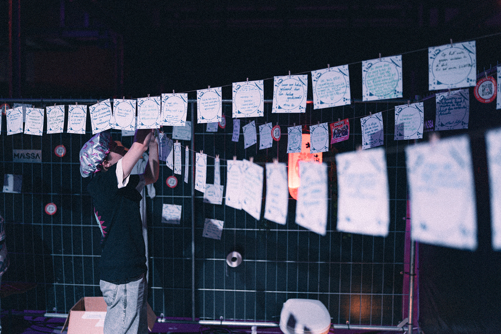

*Photos by [@madebyjanephotography](https://www.instagram.com/madebyjanephotography/)*

  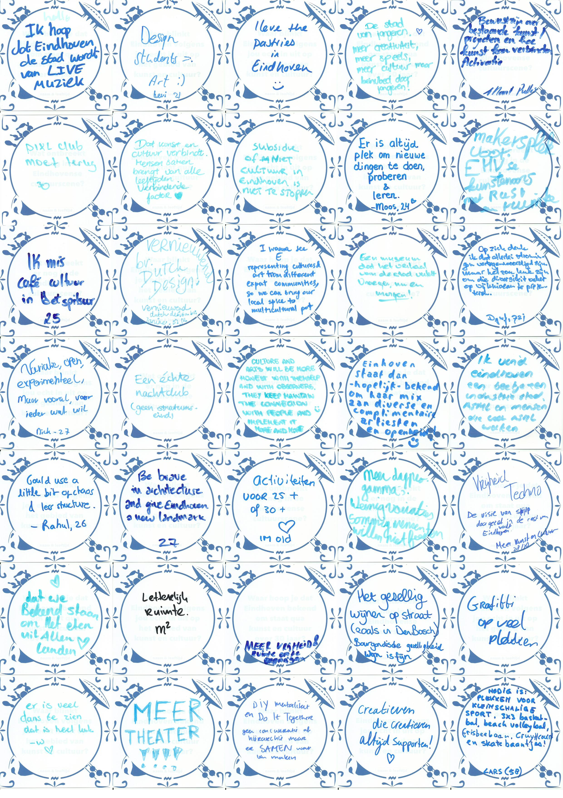
  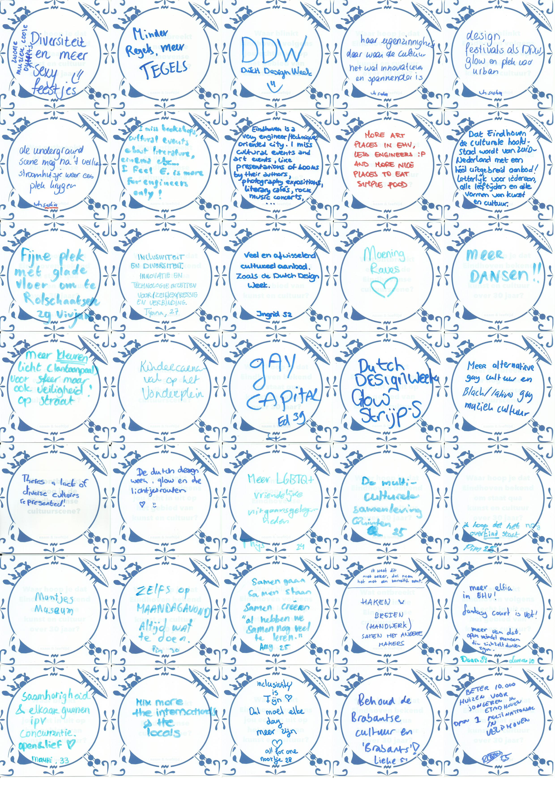
  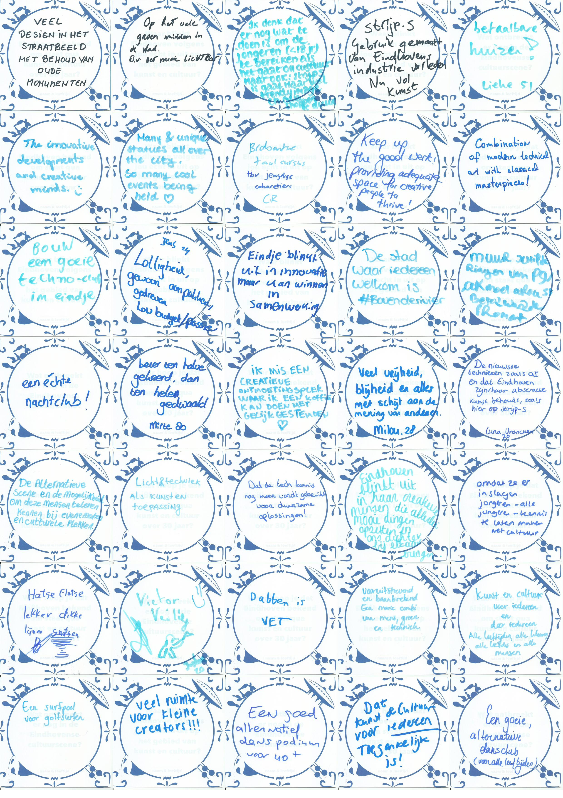
  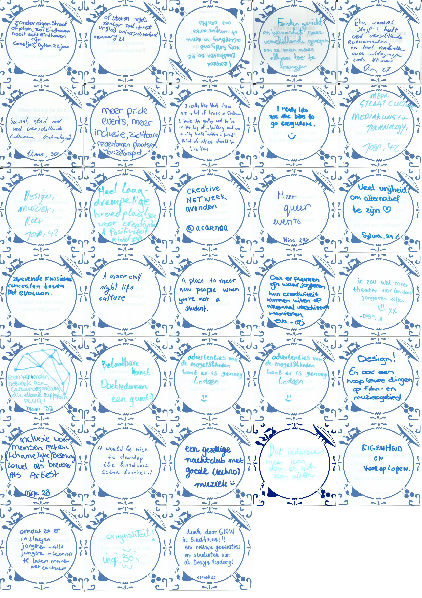

Alle tegels

  

### Resultaat  
De installatie werd druk bezocht en de reacties waren enthousiast. Bezoekers vonden het verrassend en leuk om op deze manier over cultuur te praten. De tegels boden een tastbaar medium om hun stem achter te laten.  

In totaal verzamelden we **140 tegels** met ideeën, meningen en dromen. Deze verzameling laat zien hoeveel kunst en cultuur leeft in Eindhoven en vormt een inspiratiebron voor de toekomst. De resultaten hbbenn we gepresenteerd tijdens de **Adviespresentatie in het Stadhuis op 7 oktober 2025**.  

  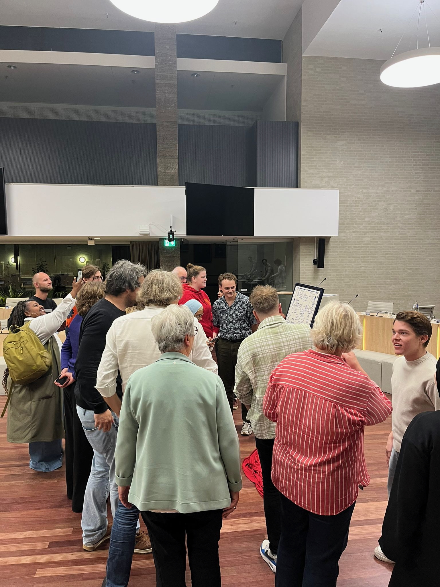
  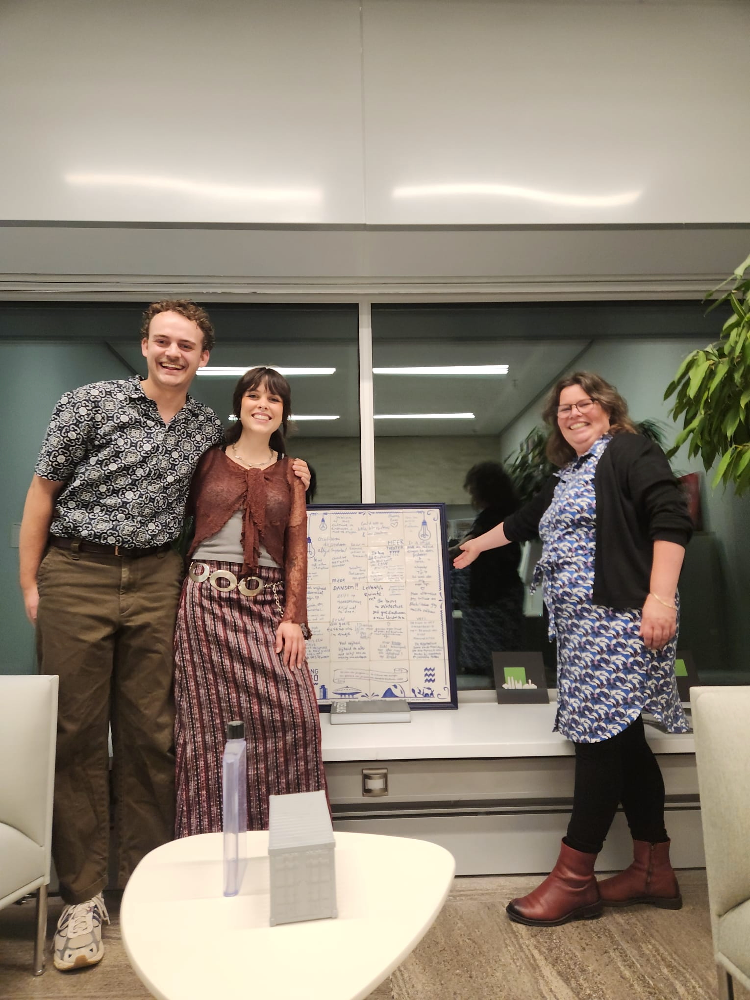
  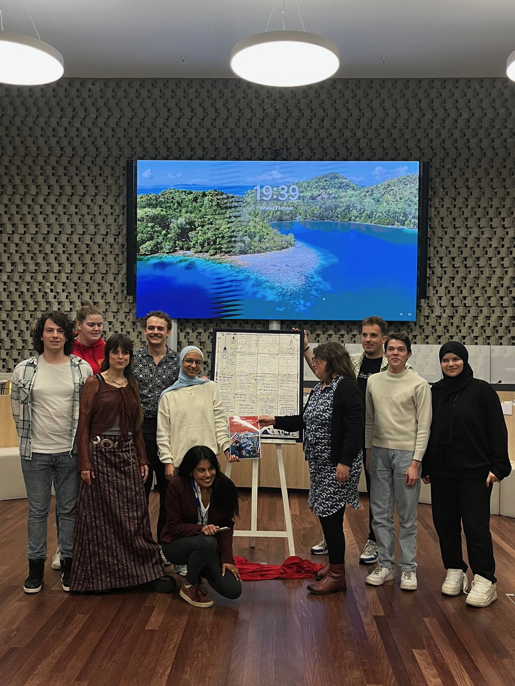
  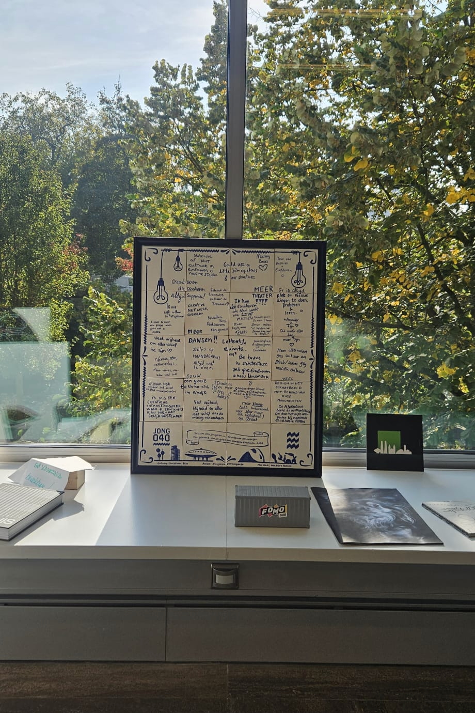

Heel veel dank aan,  
Vivjan Champness (Kunstenares voor de tegels)  
De organisatie van DIY  
De vrijwilligers van Jong040 die hebben meegeholpen