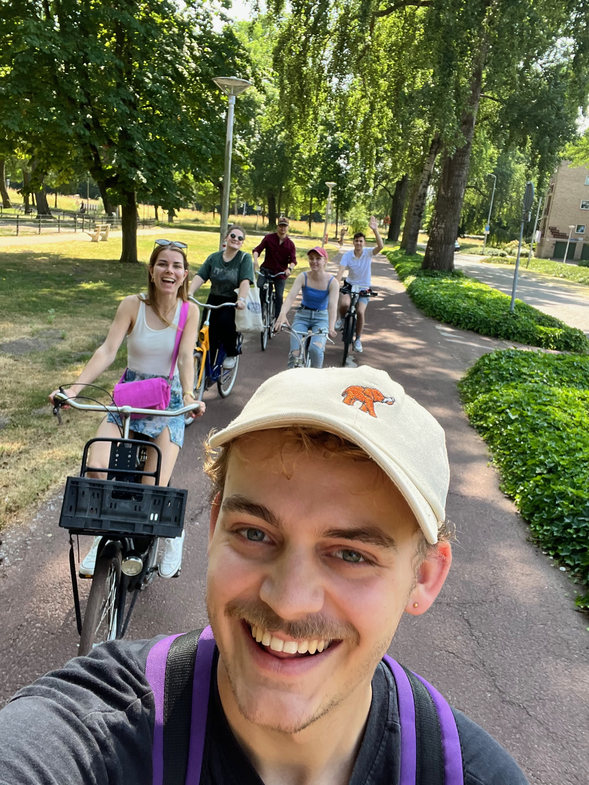

19-06-2023 was de eerste editie van Toos Autoloos.

Met Toos Autoloos probeer ik jongeren te inspireren om werk op fietsafstand te vinden.
Dit doe ik door fietstochten te organiseren naar leuke bedrijven om te laten zien waar jij in de buurt allemaal zou kunnen werken. Hiermee hoop ik deze jongeren te helpen om de behoefte voor een auto minder dringend te maken. Daardoor hoop ik dat we een stapje dichterbij een autoloze generatie komen.

Met deze eerste editie waren we welkom bij de Workplace Vitality Hub op de High Tech Campus. We verzamelden in het centrum van eindhoven en gingen er fietsend naartoe. Wisten jullie dat er een ‘slowlane’ is vanuit het centrum naar de high tech campus? Een slowlane is een interessante naam voor een snelfietspad maar het is wel ontzettend fijn. De route loopt langs de dommel af tot en met de campus. Je fietst een en al door het groen.

Bij de vitality hub werden wij ontvangen door Gerard Huiskes en Sywert Brongersma. Hier kregen we een presentatie over waar ze mee bezig zijn en daarna ook een leuke rondleiding.

Denk jij nou, ik wil dat toos autoloos langskomt bij mijn bedrijf of wil je graag meefietsen. Stuur me even een berichtje. Want de volgende editie word al aan gewerkt!

Bedankt aan alle deelnemers en StadsMakers Eindhoven voor het mogelijk maken van de eerste editie van TOOS AUTOLOOS