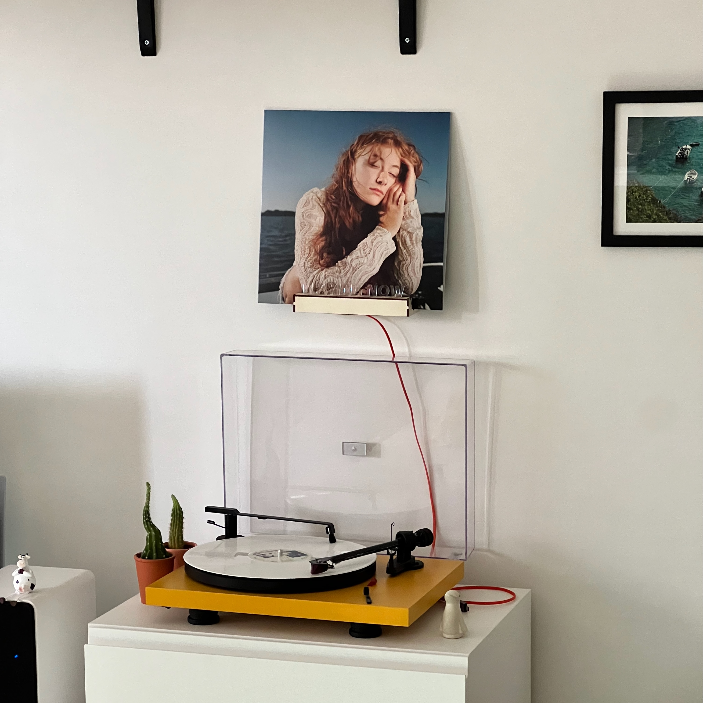
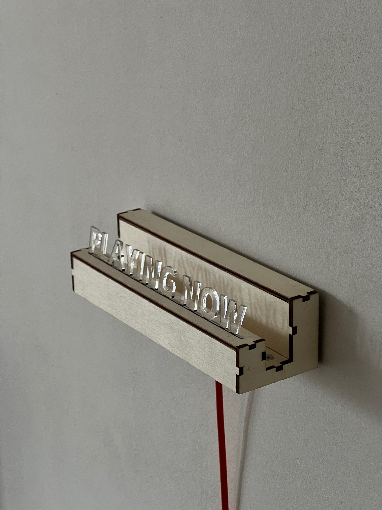
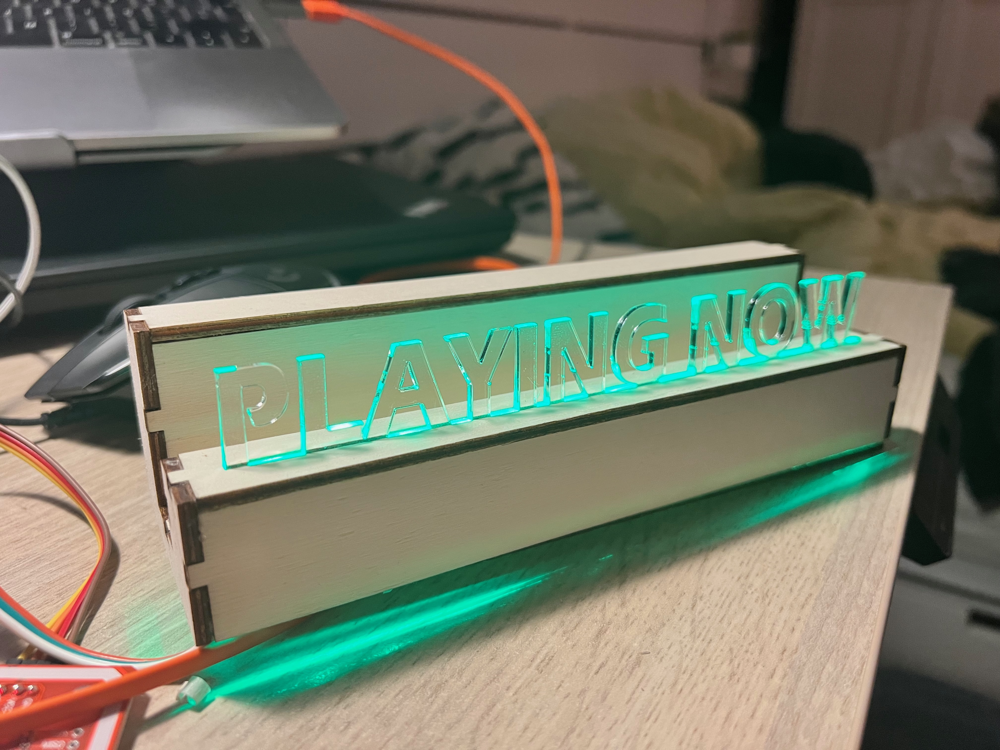

At the end of each year you can get a nice overview of the music you listened to that year with spotify wrapped. However, when I play one of my vinyls it will not automatically be tracked. In order for me to make a vinyl wrapped I needed a system that automatically tracks when I play a vinyl from my collection.
To do this, I designed and built the vinyl shelf you see on this picture. Inside of this shelf there is a tag reader that automatically scans NFC tags placed on the covers of the vinyls. The hardware inside consists of a tag reader and an ESP32. The ESP32 is connected to my home Wifi network and sends updates to a server, and also reports readings to a telegram bot.

All software for this project is open source and can be found on my github page!
https://github.com/ChrisB2351/vinyl-scanner

