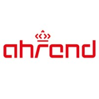
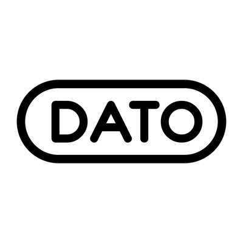
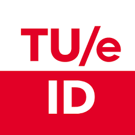
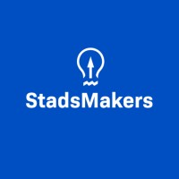
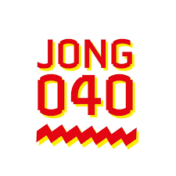
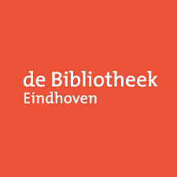

__Christiaan Bloo__  
*Eindhoven, NL*

## Jobs

  
  

  __3D Configuration Engineer__ - Royal Ahrend Group  
  *Oct 2022 - Present*

  > During my time at Ahrend, I have build 3D configuration models for different kinds of products such as desks, tables, soft-seating and storage solutions of leading brands such as Ahrend, Gispen and Techo. These 3D configuration models are used by the account managers, customer support and interior designers. Next to this I worked on analysis of big data sets, to create an overview of the whole Ahrend product portfolio.
  
  __Skills__: _Rhino3D, pCon, Data analysis, Python_
  

  
  

  __Industrial Design Intern__ - DATO Musical Instruments  
  *Sep 2021 - May 2022*
  > As an industrial design intern my focus was on creating fully functional prototypes. Learning skills like making custom PCB’s and 3D printing along the way.  
  
  __Skills__: _Product Design, C++, Printed Circuit Board (PCB) Design, Autodesk Fusion 360_
  

## Education

  
  

  
  __BSc Industrial Design__ - Eindhoven University of Technology  
  *2019 - 2022* 
  > Industrial design at Eindhoven uses Challenge Based Learning. I worked on different projects to grow my skills in creating prototypes and testing these with users.
  

  
  

  __Stadsmakers__ - De Bildung Academy  
  *Mar 2023 - Jun 2023* 
  > During Stadsmakers you define your dream for Eindhoven, then work on a project for 13 weeks to get help the city get closer to your dreams. My dream was a car free Eindhoven, and my project result was Toos Autoloos. A project to show graduating students around the city and provide tours at possible employers in the hopes to get them to find jobs close by, so that they can bike there. [Project page](https://www.stadsmakerseindhoven.nl/de-stadsmakers/christiaan-bloo)
  

## Volunteering

  
  

  __Jongeren Ambassadeur__  - Jong040  
  *Sep 2023 - Present*  
  > Als jongeren ambassadeur bij jong040 houd ik me bezig met maatschappelijke relevante projecten over onderwerpen zoals de verkiezingen en de wooncrisis. Elke 2 weken komen we met een groep jongeren bij elkaar en werken we naar een adviesrapport of actie toe. De eerste ronde waaraan ik deelnam ging over jongeren naar de stembus krijgen. Hiervoor stonden we op het 18-september plein met de quote: 'Heb jij ook schijt aan de politiek'. Om op die manier gesprekken aan te gaan met jongeren. [ED-artikel](https://www.ed.nl/eindhoven/schijt-aan-de-politiek-maar-toch-gaan-stemmen-jong040-hoopt-het-laatste-zetje-te-geven~a53241c3/)

  __Skills__: _Politics, Communication, Debating_
  

  
  

  __Makersplaats__ - Bibliotheek Eindhoven  
  *Nov 2023 - Present*   
  > The Makersplaats (Makers space) is a small workshop where kids can work on projects in the library. Open on friday afternoon and saturday morning, kids get 90 minutes to work on something of their own projects. As a volunteer I help the kids to learn new skills such as woodworking, 3D modelling/printing, laser cutting and even soldering.  
  
  __Skills__: _3D Printing, Lasercutting, Coaching_
  

  
  

  __Chief Grahic Design__ - UNID  
  *Sep 2021 - Oct 2022* 
  > As a chief graphic designer, I lead a small team of graphic designers to make multiple magazines a year. Next to that, I am responsible for creating the look and feel of the magazines by creating style guides and by being in charge of the printing of the magazine.

  __Skills__: _Graphic Design, Adobe InDesign, Leadership_

  __Treasurer__ - UNID  
  *Sep 2021 - Oct 2022*   
  > As Treasurer, my responsibilities were finding a printing partner for the magazine, and managing expenses for release parties of new magazine editions.

  __Skills__: _Treasury, Cash Management, Microsoft Excel_

  __Grahic Designer__ - UNID  
  *Sep 2020 - Sep 2021*   
  > Working as a graphic designer creating online content.

  __Skills__: _Graphic Design, Adobe Illustrator, Adobe Photoshop_
  

 